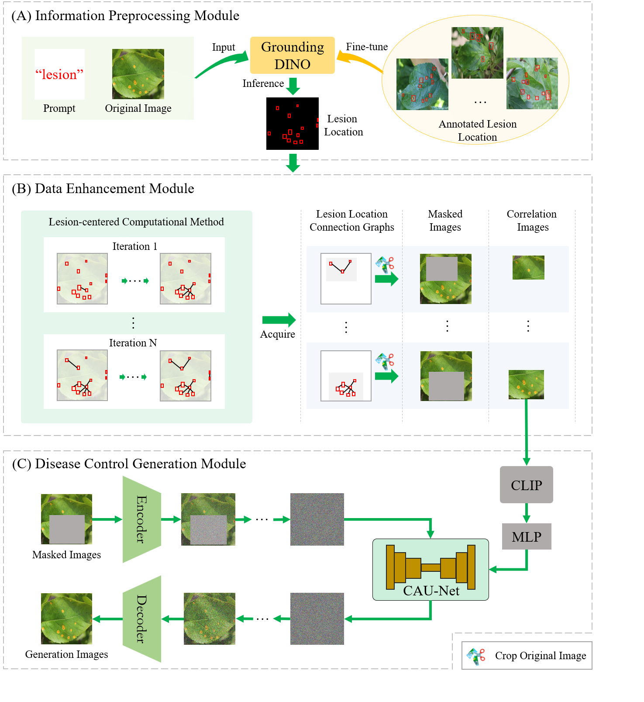
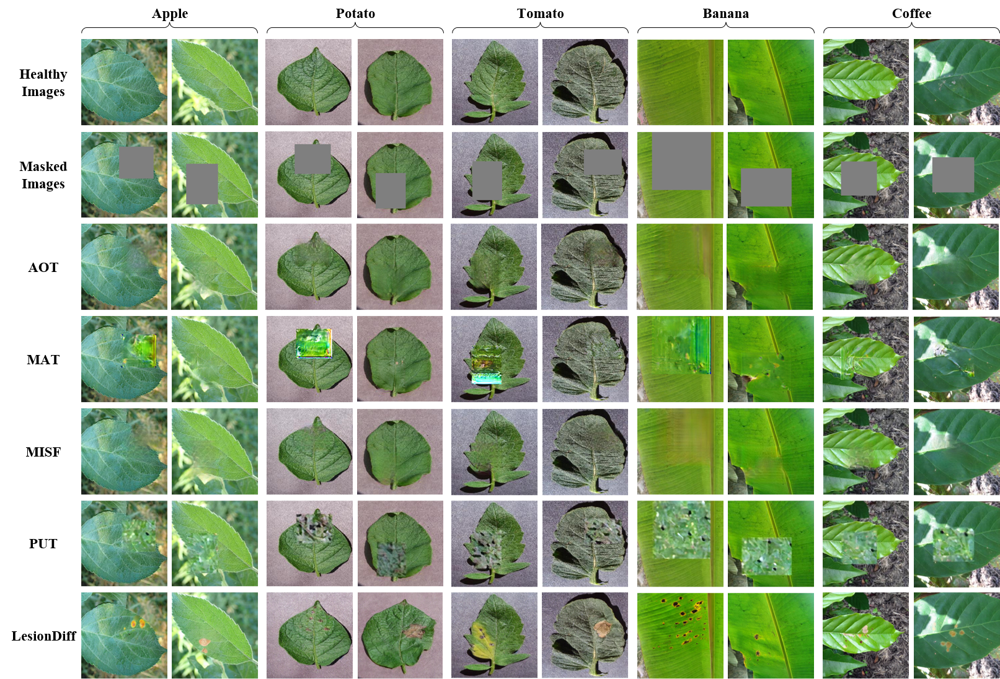
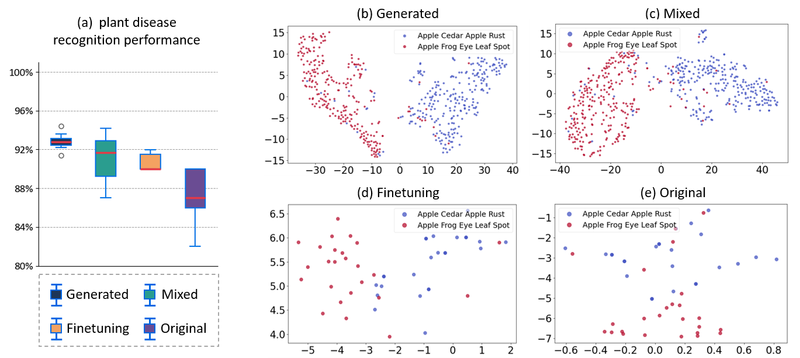
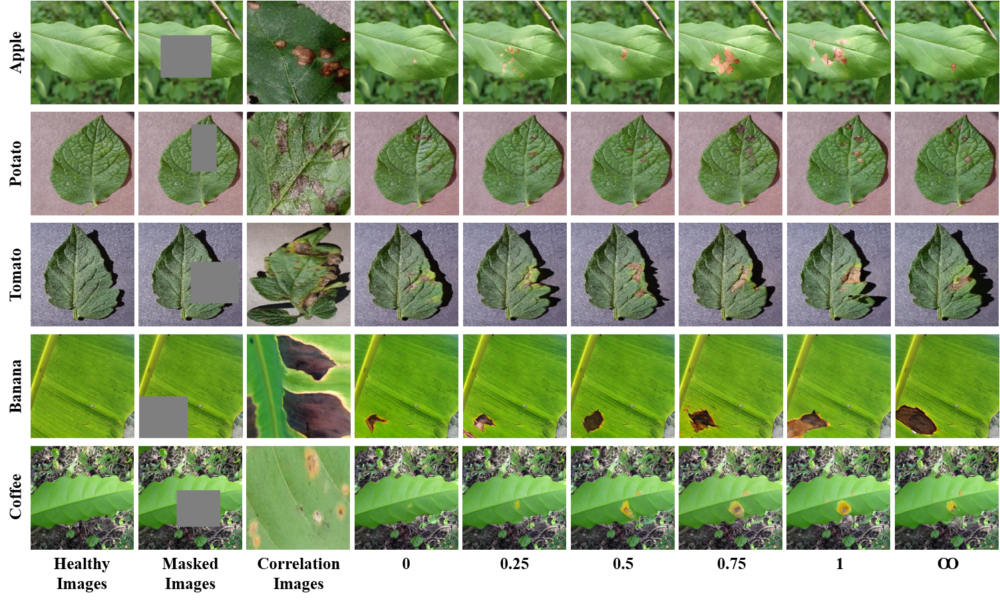
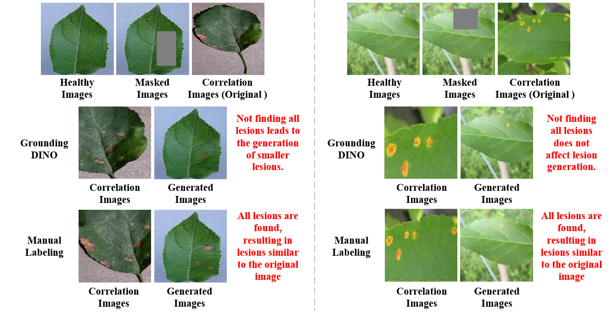
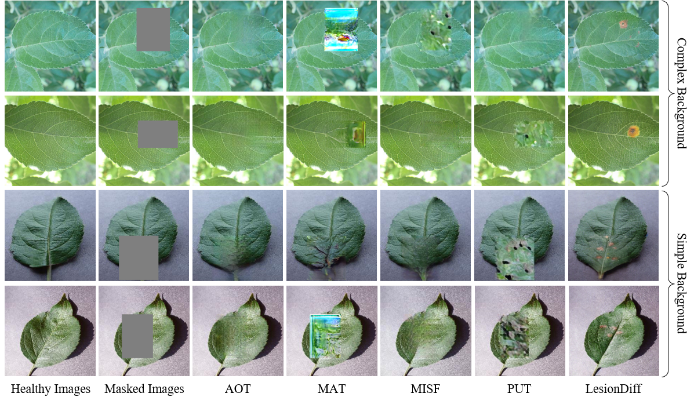
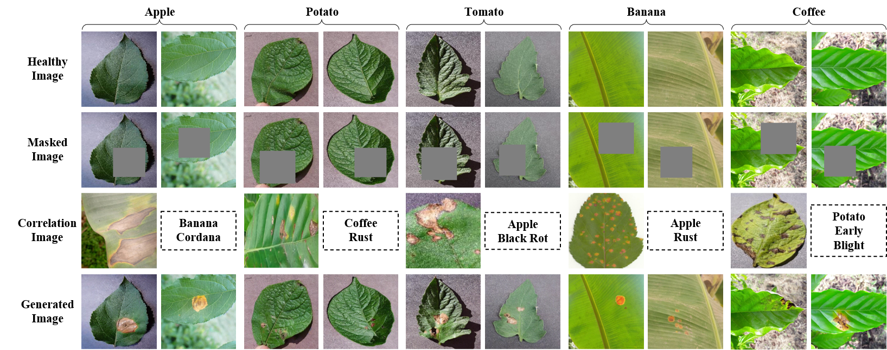
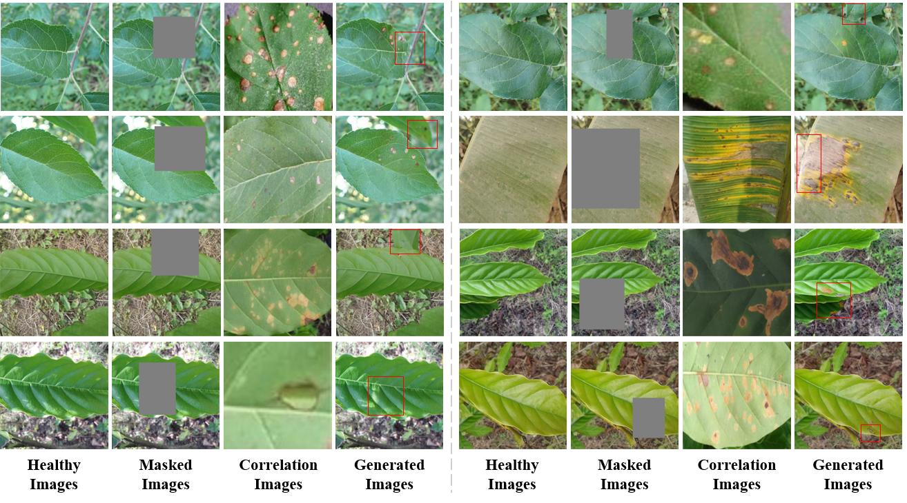

## LesionDiff
LesionDiff: Synthetic Data via Lesion Information Transfer Diffusion Model Facilitates Plant Disease Diagnosis

# Abstract
Precise identification of plant diseases is crucial for effective control and can significantly enhance crop yields. As deep learning techniques for identifying crop diseases become mainstream, training models typically require large-scale image datasets to improve accuracy and generalization. However, the acquisition of such datasets is often hindered by factors such as weather conditions, environmental variables, and different growth stages, which leads to the lack of sufficient and available plant disease images for plant disease diagnosis methods. To address this issue, we propose a lesion information transfer diffusion model (LesionDiff) to synthesize image data that aligns with human visual perception. Our model comprises three key components: an information preprocessing module, a disease data enhancement module, and a disease control generation module. The information preprocessing module employs GroundingDINO, fine-tuned for plant diseases, to accurately identify lesion areas on leaves. The disease data enhancement module utilizes a lesion-centered computing strategy to enrich the dataset with more correlation images, enabling the model to learn a broader range of visual and semantic lesion characteristics. Finally, the disease control generation module leverages the pre-trained CLIP model to extract guiding image features, prompting the diffusion model via U-Net with cross-attention (CAU-Net) to complete the missing regions of masked disease images. Experimental results show that with the help of synthetic plant disease images, the diagnostic model's average accuracy on original plant disease images increases by more than 3\%, demonstrating the effectiveness of LesionDiff in enhancing plant disease recognition models.

## Environment
You can create a new Conda environment by running the following command:
```
    conda env create -f environment.yml 
```
In the environment, we still use other networks. If it does not work, please configure the environment of other networks first.
## PreTrained Model
The pre-trained PlantDid model is linked below, you can download it.
<li>PlantDid:https://drive.google.com/file/d/1VMu7AMv6SYp9HXWpjXmERAsmhh8aahFY/view?usp=drive_link
<li>And we use GroundingDINO, the download is:
https://drive.google.com/drive/folders/1z7Xxm-ZpTC0k4qyaCjyEJqh_q1rou1Ba?usp=drive_link

## Test

If you want to batch test, you can use `leaf_diseases/inference_bench_gd_auto.py`. For example,
```
    python leaf_diseases/inference_bench_gd_auto.py 
    --config configs/leaf-diseases_with_disease.yaml
    --test_path TestDataset/apple 
    --outdir Result/inferenceTest 
    --ddim_steps 200 --ddim_eta 1.0 --scale 4 --seed 250 
    --ckpt models/last.ckpt 
    --max_size 250
```
In `--test_path` you can change the type of plant you want to test based on the test set we provide

# Framework


# The presentation of LesionDiff and baseline generated images of plant diseases.


# Demonstrate the use of generated images to promote plant disease recognition performance.


# The demonstration of plant disease image generation with different $\lambda$


# The presentation of generated images based on correlation images obtained by different lesion location acquisition methods.


# The demonstration of generated images of plant diseases in different scenarios.


# The demonstration of the ethics and social impact of plant disease image generation.


# The demonstration of more plant disease image generation cases.

